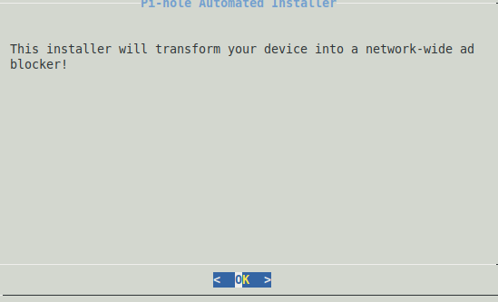
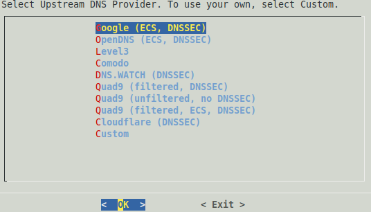

# introduciton
welcome back! in this part i will be setting up my pi-hole dns server

## Step (1/3) install
to install pi-hole im following the [documention](https://docs.pi-hole.net/main/basic-install/) for a basic install   
to start the install i will run the following command ```curl -sSL https://install.pi-hole.net | bash```
this brings us the this image   
    

i hit enter on this slide and again on the next one.   
    
we will hit continue on this one as i have set my router to only give out static ip's


   
i'll select wlan0 as im using the pi's built in wifi chip to accses my network and not ethernet   


   
i'll be selecting google for the dns as it's the defualt one, we will also use the default blocklist for now, after that i will select yes to everything as i don't need to custmize it too much   

## Step (2/3) Config
once i have installed pi-hole i changed the password using the command ```pihole -a -p```   
once that's done i wanted to point my laptop too the pi-hole server, i went into my dns settings and changed it

     
once i did that i decied to login as there's some settings i want to change i went to the webserver located at http://<rpi_ip>/admin   

once logged in i wen't back to my mechine and ran these commands to change my defualt dns server   
```
nmcli con show
nmcli con modify <connectionName> ipv4.ignore-auto-dns yes
nmcli con modify <connectionName> ipv4.dns "dns1 dns2"
nmcli con down <connectionName>
nmcli con up <connectionName>
```

to do this your self replace `connectionName` with the name of your wifi and change `dns1` to the pi's ip and `dns2` to your defualt dns ip as a backup incase your rpi goes down after doing that we can go to [pi.hole](http://pi.hole/)

## Step (3/3) Testing
    
after that we can add a sample domain we wish to block, i checked add wild card as sometimes you can get ad's on them redirecting you to a site where you can buy it. once the information is filled out we can click add to blacklist.    
when we try go too the [site](http://test_domain_not_real.fake/) we get a `this site cannot be reached` message, if you really wanted to dubble check it tho you could reanable your dns and see if it directs you anywhere or block a site you know is a valid one to dubble check if it can block sites.


## Outro
thank you for taking the time to read this, it's always good to try learn a new tech or tool and one thing im aiming for with this is to eventualy turn it into a portable router/defence device with it being able to detect bad traffic, networks and even checking if a usb stick i find on the floor isn't actualy a USB ruberducky.   

the next part of this project is [here](http://github.com/buffkermitisagod/) where we will setup a openvpn servr and port forwading!
